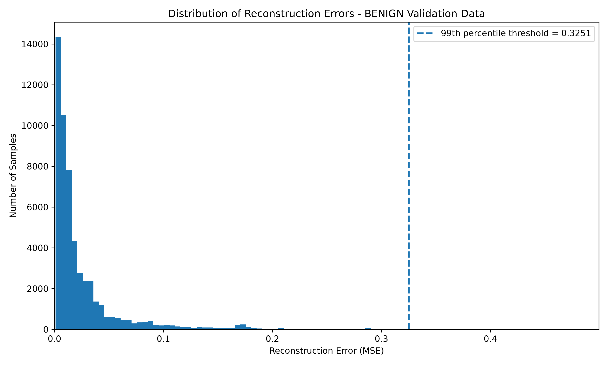
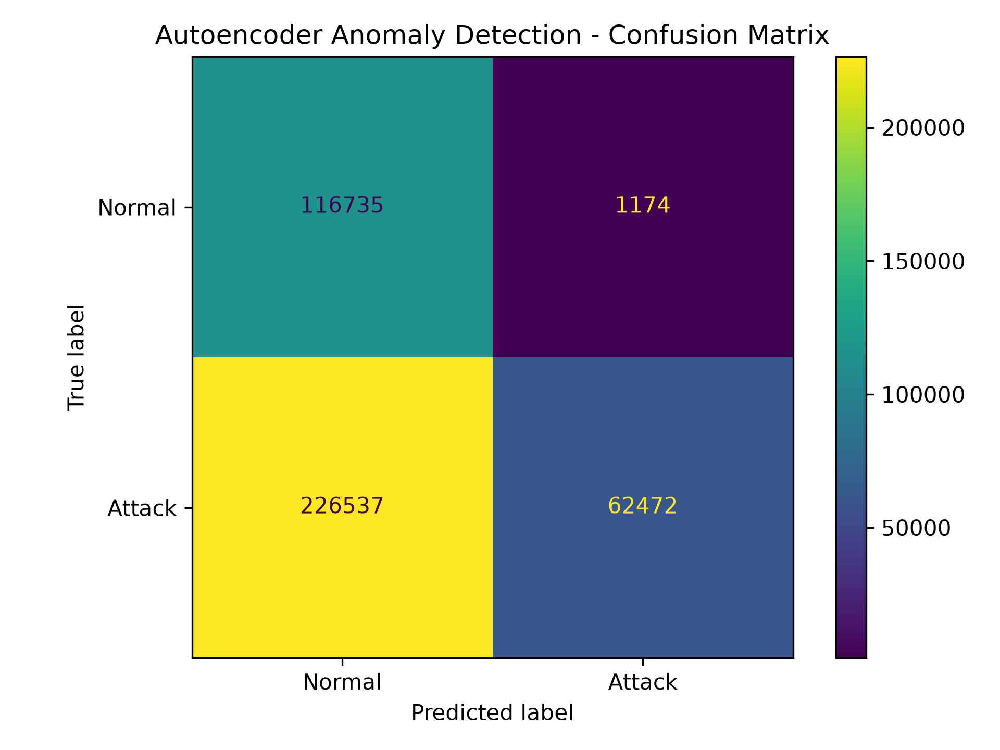
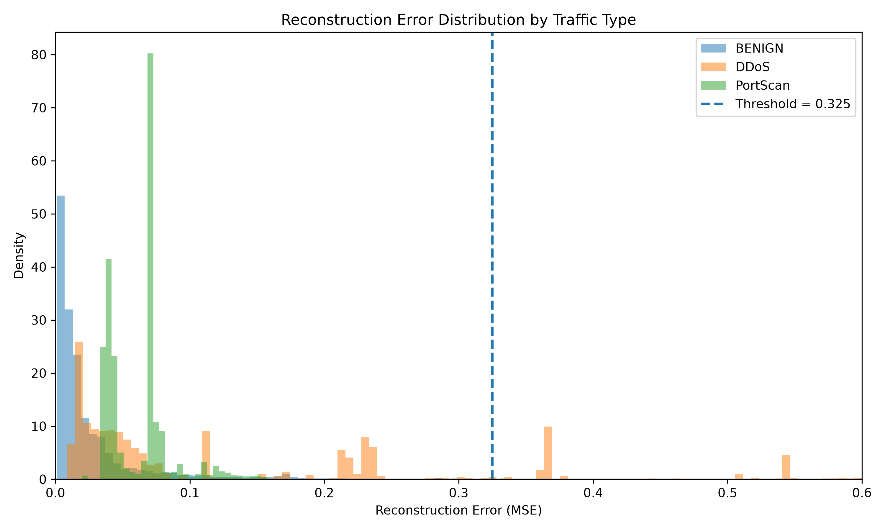
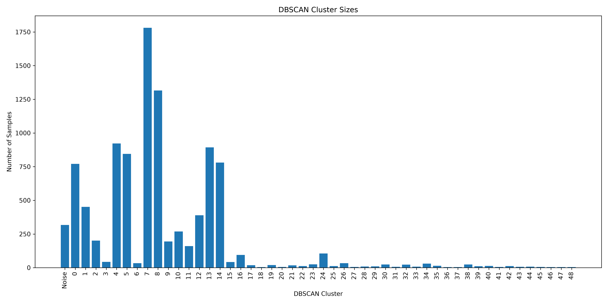
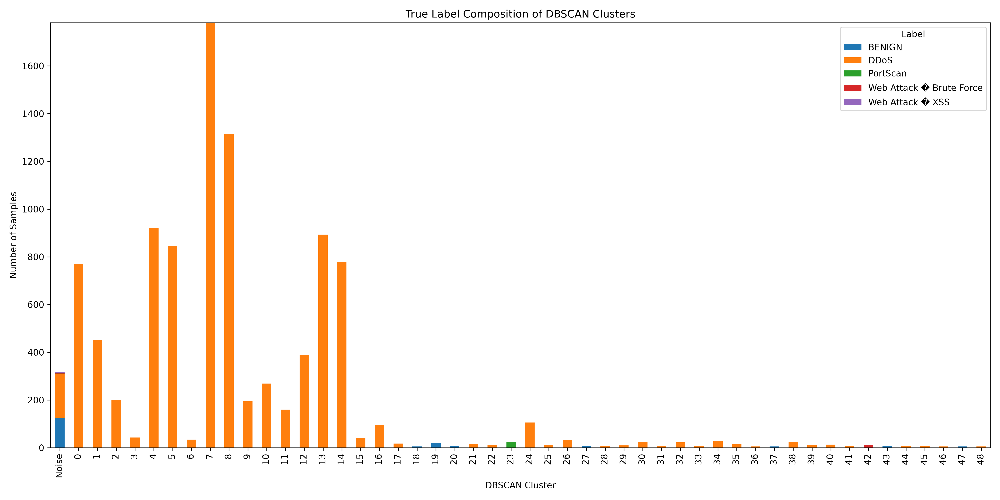

# Network Intrusion Anomaly Detection with Autoencoder and DBSCAN

An experimental network intrusion detection project using an **Autoencoder** and **DBSCAN** to identify and analyze anomalous network traffic from the **CICIDS2017** dataset.

The project explores an unsupervised anomaly-detection approach in which an Autoencoder is trained exclusively on benign network traffic. Network flows that cannot be reconstructed accurately are treated as potential anomalies. The latent representations of the detected anomalies are then analyzed using DBSCAN to examine whether meaningful density-based structures emerge.

> **Note:** This project is a simplified experimental implementation inspired by the methodology of Kaliyaperumal et al. (2024). It is not intended to reproduce the original study exactly.

---

## Project Goals

The main goals of this project are to:

- Build an anomaly-based intrusion detection pipeline using real network-flow data.
- Train an Autoencoder to learn patterns of benign network traffic.
- Detect anomalous flows using reconstruction error.
- Examine how different attack types behave under the same anomaly threshold.
- Use the Autoencoder's latent representation as input to DBSCAN.
- Analyze whether detected anomalies form meaningful density-based clusters.
- Explore practical challenges such as class imbalance, threshold selection, memory limitations, and the distinction between anomalous and malicious behavior.

---

## Detection Pipeline

```text
CICIDS2017 Network Flows
          |
          v
    Data Cleaning
   NaN / Infinity Removal
          |
          v
   Train / Test Split
          |
          v
  Z-score Normalization
          |
          v
      Autoencoder
  78 -> 32 -> 16 -> 32 -> 78
          |
          v
   Reconstruction Error
          |
          v
  99th Percentile Threshold
          |
          v
    Detected Anomalies
          |
          v
  16-D Latent Representation
          |
          v
        DBSCAN
          |
          v
     Cluster Analysis
```

The Autoencoder performs two roles in the pipeline. First, reconstruction error is used to determine whether a network flow is anomalous. Second, the 16-dimensional representation produced by the encoder provides a compact feature space for clustering the detected anomalies with DBSCAN.

---

## Dataset

The experiment uses a subset of the **CICIDS2017** dataset containing network flows from three CSV files:

- DDoS traffic
- PortScan traffic
- Web Attack traffic

The selected files contain both benign and malicious network flows. After removing rows containing missing or infinite numerical values, the combined dataset contained:

**682,038 network flows with 78 numerical features.**

The resulting label distribution was:

| Traffic Type | Samples |
|---|---:|
| BENIGN | 393,029 |
| PortScan | 158,804 |
| DDoS | 128,025 |
| Web Attack - Brute Force | 1,507 |
| Web Attack - XSS | 652 |
| Web Attack - SQL Injection | 21 |

The original CICIDS2017 dataset is **not included in this repository** due to its size.

---

## Data Preprocessing

Rows containing `NaN` or infinite numerical values were removed before training.

```python
numeric_df = df.select_dtypes(include="number")

rows_with_inf = np.isinf(numeric_df).any(axis=1)
rows_with_nan = df.isna().any(axis=1)

invalid_rows = rows_with_inf | rows_with_nan
df_clean = df[~invalid_rows].copy()
```

A total of **540 invalid rows** were removed from the selected files:

| File | Removed Rows |
|---|---:|
| DDoS | 34 |
| PortScan | 371 |
| Web Attacks | 135 |

No missing values were imputed. Removing the affected observations avoided introducing synthetic feature values into the experiment.

### Train/Test Strategy

The Autoencoder was trained exclusively on benign traffic.

The 393,029 benign observations were divided into:

- **70% (275,120 flows)** for Autoencoder training and validation.
- **30% (117,909 flows)** for testing.

All attack observations were added to the test set, resulting in:

**406,918 total test observations.**

The labels were used only for dataset partitioning and subsequent evaluation. They were **not provided to the Autoencoder as input features**.

### Z-score Normalization

A `StandardScaler` was fitted only on the training data:

```python
scaler = StandardScaler()

X_train_scaled = scaler.fit_transform(X_train).astype("float32")
X_test_scaled = scaler.transform(X_test).astype("float32")
```

The same training statistics were then used to transform the test data. This prevents information from the test set from influencing preprocessing during training.

The feature matrices were also converted to `float32` to reduce memory consumption.

---

## Autoencoder Architecture

The anomaly detector is based on a fully connected Autoencoder implemented with PyTorch.

```text
Input                78 features
                         |
                         v
Encoder              78 -> 32
                         |
                       ReLU
                         |
                         v
Latent Space          32 -> 16
                         |
                       ReLU
                         |
                         v
Decoder               16 -> 32
                         |
                       ReLU
                         |
                         v
Output                32 -> 78
```

The encoder compresses each network flow from 78 input features into a **16-dimensional latent representation**. The decoder then attempts to reconstruct the original 78 features from this compressed representation.

```python
class Autoencoder(nn.Module):
    def __init__(self):
        super().__init__()

        self.encoder = nn.Sequential(
            nn.Linear(78, 32),
            nn.ReLU(),
            nn.Linear(32, 16),
            nn.ReLU()
        )

        self.decoder = nn.Sequential(
            nn.Linear(16, 32),
            nn.ReLU(),
            nn.Linear(32, 78)
        )

    def forward(self, x):
        encoded = self.encoder(x)
        decoded = self.decoder(encoded)
        return decoded
```

The 16 latent values are learned combinations of the original features rather than a selection of 16 existing features.

The architecture and latent-space dimensionality were selected for this experimental implementation and are not intended to reproduce the exact Autoencoder architecture of the original study.

---

## Model Training

The 275,120 benign observations allocated to model development were further divided into:

| Set | Samples |
|---|---:|
| Training | 220,096 |
| Validation | 55,024 |

The model was optimized using **Mean Squared Error (MSE)** as the reconstruction loss and the **Adam optimizer**.

| Parameter | Value |
|---|---|
| Loss function | MSE |
| Optimizer | Adam |
| Learning rate | 0.0001 |
| Batch size | 256 |
| Maximum epochs | 50 |
| Early stopping patience | 5 |

The central training step was:

```python
optimizer.zero_grad()

reconstructed = model(x)
loss = criterion(reconstructed, x)

loss.backward()
optimizer.step()
```

The model attempts to minimize the difference between each benign input flow and its reconstruction.

Validation data was not used to update model weights. It was used to monitor reconstruction performance and implement early stopping.

The validation loss continued improving throughout training, so all 50 epochs were completed. Validation MSE decreased from approximately **0.5444** in the first epoch to **0.0393** in the final epoch.

---

## Anomaly Detection

After training, reconstruction error was calculated independently for every validation observation:

```python
reconstructed = model(x)
errors = torch.mean((x - reconstructed) ** 2, dim=1)
```

For every network flow, this calculates the mean squared reconstruction error across its 78 features.

Because the Autoencoder was trained only on benign traffic, the underlying assumption is that traffic patterns similar to those observed during training should generally be reconstructed more accurately, while sufficiently unusual patterns may produce larger reconstruction errors.

### Anomaly Threshold

The anomaly threshold was defined as the **99th percentile of reconstruction errors on the benign validation set**:

```python
threshold = np.percentile(reconstruction_errors, 99)
```

This produced:

```text
Threshold = 0.32509285
```

Therefore:

```text
Reconstruction Error <= 0.3251  -> Normal
Reconstruction Error >  0.3251  -> Anomaly
```

The 99th-percentile rule is an experimental design choice in this implementation rather than a parameter reproduced from the original study.

### Validation Reconstruction Errors



The validation-error distribution is strongly right-skewed. For readability, the visualization displays the lower 99.5% of validation reconstruction errors; the anomaly threshold itself was calculated using the complete validation set.

---

## Test Results

The final test set contained **406,918 network flows**, consisting of unseen benign traffic and all attack observations in the selected dataset subset.

The resulting confusion matrix was:

| | Predicted Normal | Predicted Attack |
|---|---:|---:|
| **Actual Normal** | 116,735 | 1,174 |
| **Actual Attack** | 226,537 | 62,472 |

This produced the following metrics:

| Metric | Result |
|---|---:|
| Accuracy | 44.04% |
| Precision | **98.16%** |
| Recall | 21.62% |
| Specificity | **99.00%** |
| F1-score | 35.43% |



The results reveal a strongly **conservative anomaly detector**.

When the model classified a flow as anomalous, it was usually correct, as reflected by the **98.16% precision**. It also correctly retained most benign flows as normal, producing **99.00% specificity**.

However, recall was only **21.62%**, meaning that a large proportion of attack traffic remained below the anomaly threshold and was therefore classified as normal.

This demonstrates an important limitation of reconstruction-based anomaly detection:

> **Malicious traffic is not necessarily anomalous enough relative to the patterns learned by the model.**

---

## Attack-Specific Behavior

The reconstruction-error distributions differed substantially between attack types.



Detection rates for the major attack categories included:

| Traffic Type | Detection Rate |
|---|---:|
| DDoS | 48.56% |
| PortScan | 0.13% |
| Web Attack - Brute Force | 4.84% |
| Web Attack - XSS | 2.91% |
| Web Attack - SQL Injection | 0.00% |

DDoS traffic produced substantially larger reconstruction errors and was therefore much more likely to cross the anomaly threshold.

PortScan behaved very differently. Although its median reconstruction error was higher than that of benign traffic, most PortScan observations remained far below the threshold. As a result, almost all PortScan flows were missed by the detector.

The SQL Injection subset contained only **21 observations**, so its detection result should not be interpreted as representative performance for that attack category.

These results illustrate why treating **"attack"** and **"anomaly"** as equivalent concepts can be misleading. Different malicious behaviors may differ substantially in how unusual they appear relative to learned benign traffic.


---

## Latent-Space Analysis with DBSCAN

After anomaly detection, the **63,646 flows classified as anomalous** were passed through the trained encoder.

Instead of using the original 78 features, only the encoder output was retained:

```python
encoded = model.encoder(anomaly_tensor)
latent_vectors.append(encoded.numpy())
```

This produced a matrix containing:

```text
63,646 observations x 16 latent features
```

The true traffic labels were stored separately for later evaluation and were **not provided to DBSCAN**.

This distinction is important: DBSCAN clusters observations based only on their positions in the learned 16-dimensional latent space. It has no knowledge of whether a sample represents DDoS, PortScan, benign traffic, or another attack category.

---

## DBSCAN Sampling

An initial attempt to run DBSCAN on all 63,646 latent representations exceeded the available memory of the experimental environment.

Unlike Autoencoder inference, DBSCAN relies on relationships between observations when determining local density and neighborhoods. Processing independent chunks and combining their cluster IDs afterward would therefore change the clustering problem.

For this reason, a reproducible random sample of **10,000 detected anomalies** was selected:

```python
sample_size = min(10000, len(X))

rng = np.random.default_rng(42)
sample_indices = rng.choice(
    len(X),
    size=sample_size,
    replace=False
)

X_sample = X[sample_indices]
```

A fixed random seed of `42` was used so that the same sample could be reproduced.

The sampling step was introduced because of computational limitations and was not part of the original study.

---

## DBSCAN Parameters

DBSCAN was configured with:

```text
min_samples = 5
eps ≈ 1.8102
```

The value `min_samples = 5` follows the MinPts value used in the referenced methodology.

For this implementation, `eps` was estimated from nearest-neighbor distances:

```python
neighbors = NearestNeighbors(n_neighbors=5)
neighbors.fit(X_sample)

distances, _ = neighbors.kneighbors(X_sample)

fifth_neighbor_distances = distances[:, -1]
eps = np.percentile(fifth_neighbor_distances, 95)
```

The 95th percentile is an experimental heuristic used in this project and should not be interpreted as a universally optimal DBSCAN parameter.

DBSCAN was then applied to the sampled latent representations:

```python
dbscan = DBSCAN(eps=eps, min_samples=5)
cluster_labels = dbscan.fit_predict(X_sample)
```

---

## DBSCAN Results

DBSCAN produced:

| Result | Value |
|---|---:|
| Sample size | 10,000 |
| Clusters | **49** |
| Noise points | **317** |
| Noise | **3.17%** |
| Points assigned to clusters | **9,683** |

### Cluster Sizes



The cluster identifiers are arbitrary density-based group identifiers. A DBSCAN cluster should therefore **not** be interpreted directly as an attack category.

For example, several different clusters contained predominantly DDoS observations. This indicates that observations belonging to the same known attack category may occupy several separate dense regions of the latent space.

### True-Label Composition

To inspect the resulting clusters, the DBSCAN assignments were compared with the original CICIDS2017 labels **after clustering**:

```python
pd.crosstab(
    sample_data["Cluster"],
    sample_data["Label"]
)
```



Several clusters were dominated by DDoS traffic, while some smaller clusters contained concentrations of observations belonging to other attack categories.

This does **not** mean that DBSCAN classified those attack types. The true labels were used only for post-hoc analysis.

A useful distinction is therefore:

```text
Dataset Label  -> known semantic traffic category
DBSCAN Cluster -> density-based structure in latent space
```

Similarly, a point labeled as DBSCAN `Noise` is not automatically malicious. Noise simply indicates that the observation did not belong to a sufficiently dense region under the selected DBSCAN parameters.

---

## An Important Pipeline Limitation

DBSCAN operates only on observations that were already classified as anomalies by the Autoencoder.

```text
Test Traffic
     |
     v
Autoencoder
     |
     +---- Predicted Normal
     |
     +---- Predicted Anomaly
                |
                v
              DBSCAN
```

Therefore, DBSCAN cannot recover attacks that were missed during the Autoencoder stage.

This is particularly important for PortScan. Only **205 of 158,804 PortScan observations** were detected as anomalies and became eligible for DBSCAN analysis.

Consequently, even if a subset of those observations forms a relatively homogeneous cluster, this should not be interpreted as strong overall PortScan detection performance.

---

## Memory-Aware Implementation

The experiment was performed in a memory-constrained virtual machine, so several implementation choices were made to reduce memory usage without reducing the number of observations used by the Autoencoder.

Feature matrices were stored as `float32`, and unnecessary intermediate objects were released before processing subsequent datasets.

During test inference and latent-vector extraction, CSV files were processed in chunks of 10,000 observations:

```python
for chunk in pd.read_csv(
    "data/cleaned/X_test_scaled.csv",
    dtype=np.float32,
    chunksize=10000
):
```

Chunking changed only how many observations were held in memory at one time. **All 406,918 test observations were still evaluated by the Autoencoder.**

The later DBSCAN sample of 10,000 observations is different: this was an actual reduction of the clustering input necessitated by memory limitations.

---

## Limitations

This project should be interpreted as an experimental implementation rather than a reproduction of the complete methodology presented in the referenced study.

Important limitations include:

- Only a subset of CICIDS2017 was used.
- A single Autoencoder was implemented rather than the complete bAE/dAE architecture described in the original study.
- The `78 -> 32 -> 16 -> 32 -> 78` architecture was selected for this implementation.
- The 99th-percentile anomaly threshold was an experimental choice.
- The 95th-percentile nearest-neighbor heuristic for `eps` was an experimental choice.
- DBSCAN was evaluated on a random sample of 10,000 detected anomalies because of memory constraints.
- DBSCAN cannot analyze attacks that were missed by the Autoencoder.
- Some attack categories contain very few observations in the selected subset.
- Results should not be compared directly with metrics reported by the original study because the dataset subset, architecture, data split, and experimental parameters differ.

These limitations are also useful experimentally: they demonstrate how preprocessing, representation learning, threshold selection, computational constraints, and clustering parameters can significantly influence an anomaly-detection pipeline.

---

## Project Structure

```text
autoencoder-dbscan-ids/
|
|-- src/
|   |-- preprocess_data.py
|   |-- prepare_data.py
|   |-- split_and_scale.py
|   |-- train_autoencoder.py
|   |-- detect_anomalies.py
|   |-- prepare_dbscan.py
|   |-- run_dbscan.py
|   |-- plot_test_errors.py
|   `-- plot_dbscan.py
|
|-- results/
|   |-- validation_reconstruction_errors.png
|   |-- test_reconstruction_errors_by_label.png
|   |-- confusion_matrix.png
|   |-- dbscan_cluster_sizes.png
|   `-- dbscan_cluster_label_composition.png
|
|-- requirements.txt
|-- .gitignore
`-- README.md
```

Large datasets, generated CSV files, trained model weights, and the local virtual environment are intentionally excluded from version control.

---

## Running the Project

### 1. Clone the repository

```bash
git clone https://github.com/yardenbenita/autoencoder-dbscan-ids.git
cd autoencoder-dbscan-ids
```

### 2. Create a virtual environment

```bash
python3 -m venv .venv
source .venv/bin/activate
```

### 3. Install dependencies

```bash
pip install -r requirements.txt
```

### 4. Prepare CICIDS2017

Download the CICIDS2017 Machine Learning CSV files and place the selected CSV files under:

```text
data/MachineLearningCVE/
```

This experiment uses:

```text
Friday-WorkingHours-Afternoon-DDos.pcap_ISCX.csv
Friday-WorkingHours-Afternoon-PortScan.pcap_ISCX.csv
Thursday-WorkingHours-Morning-WebAttacks.pcap_ISCX.csv
```

Create the output directories if necessary:

```bash
mkdir -p data/cleaned results
```

### 5. Run the pipeline

Execute the scripts in the following order:

```bash
python src/preprocess_data.py
python src/prepare_data.py
python src/split_and_scale.py
python src/train_autoencoder.py
python src/detect_anomalies.py
python src/prepare_dbscan.py
python src/run_dbscan.py
python src/plot_test_errors.py
python src/plot_dbscan.py
```

---

## Key Takeaways

This experiment highlights several practical characteristics of anomaly-based intrusion detection:

- High precision does not necessarily imply high attack coverage.
- Different attack types may produce very different reconstruction-error distributions.
- Malicious traffic is not necessarily statistically anomalous relative to learned benign behavior.
- Latent representations can preserve useful structure even when first-stage anomaly detection is imperfect.
- Density-based clusters should not automatically be interpreted as attack classes.
- Threshold and clustering parameter selection can substantially change system behavior.
- Computational constraints can influence experimental design and should be reported explicitly.

The project demonstrates not only how an Autoencoder and DBSCAN can be combined for network anomaly analysis, but also why careful evaluation and interpretation are essential when applying unsupervised methods to intrusion detection.

---

## Technologies

`Python` · `PyTorch` · `pandas` · `NumPy` · `scikit-learn` · `Matplotlib`

---

## Reference

This implementation was inspired by:

P. Kaliyaperumal, S. Periyasamy, M. Periyasamy, and A. Alagarsamy,  
**"Harnessing DBSCAN and auto-encoder for hyper intrusion detection in cloud computing,"**  
*Bulletin of Electrical Engineering and Informatics*, vol. 13, no. 5, pp. 3345-3354, 2024.

The CICIDS2017 dataset was developed by the Canadian Institute for Cybersecurity (CIC), University of New Brunswick.
